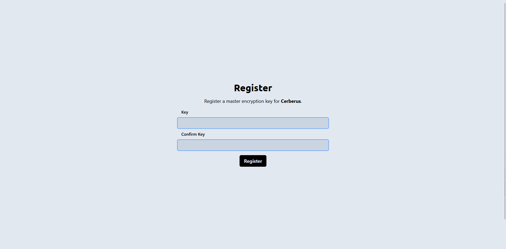

# Cerberus
encrypted file storage application, frontend React, backend Phoenix.
this is a monorepo managed by yarn.



# Requirements

- Node.js >= 20 https://nodejs.org/en/download
- Yarn  (if node is >= 25) npm i -g corepack -> yarn
- Docker https://docs.docker.com/engine/install/
- Elixir / Phoenix https://hexdocs.pm/phoenix/up_and_running.html

# Quick Start
first install all the required dependencies.

```sh
yarn
yarn --cwd frontend
yarn --cwd backend
```

run the application

```sh
yarn dev
```
